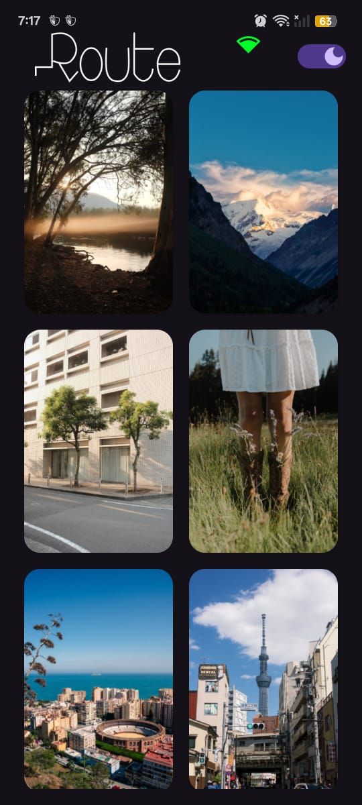
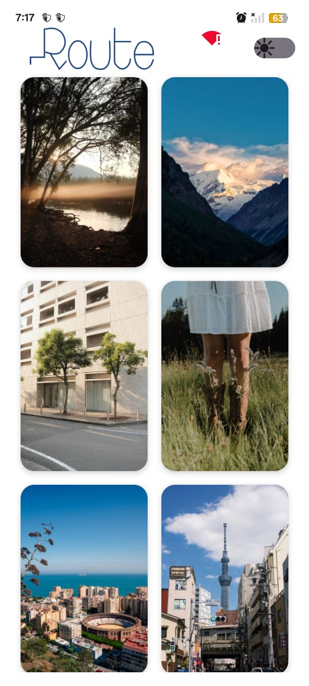

Photo Gallery Application
This is a simple Android Photo Gallery app, part of the Route Job Fair Android Task. It displays photos from the Pexels API, supports offline caching, dynamic network status, and theme management, all built with Clean Architecture and Kotlin Flow.

Table of Contents
Features

Architecture

Screenshots

Setup & Run

API Key

Libraries

Future Enhancements

Features
Photo List: Fetches and displays curated photos from Pexels API.

Infinite Scrolling/Pagination: Implemented basic infinite scrolling by looping through a fixed set of fetched photos, providing a continuous browsing experience.

Loading & Error Handling: Shows a loading indicator and a retryable Snackbar for API failures.

Offline Support: Caches photos (Room) and images (Glide) for offline viewing.

Network Status: Visual indicator for online/offline connectivity.

Theme Management: Supports Light/Dark modes with persistence across launches.

Architecture
Built with Clean Architecture (Presentation, Domain, Data layers) and MVVM using Kotlin Flow for reactive UI state. Hilt handles dependency injection for loose coupling and testability.

Presentation: UI (HomeScreen) observes PhotoViewModel's StateFlow/SharedFlow.

Domain: PhotoModel, PhotoResult, GetPhotosUseCase define business logic, independent of Android.

Data: PhotoRepository (interface in Domain, implementation in Data) manages data from PexelsApiService (Retrofit) and local Room database, handling caching and mapping.

Data Flow: UI -> ViewModel -> Use Case -> Repository (API/Local DB) -> ViewModel -> UI.

Screenshots
Online - Light Mode
Online - Dark Mode

Offline/Cached - Light Mode

Offline/Cached - Dark Mode
Loading State
Error State
Network Status Indicator (Online)
Network Status Indicator (Offline)
Setup & Run
Clone: git clone https://github.com/Aziz-thabet/Photo-Gallery-App.git & cd PhotoGalleryApp.

Open: Open in Android Studio.

Sync Gradle: Sync project. If Unresolved reference errors occur, try: close AS, delete build/, .gradle/, .idea/ (project root & app/), clear ~/.gradle/caches, re-open AS & re-sync.

SDKs: Install Android SDK Platform 34 (Tools > SDK Manager).

Build & Run: Select device/emulator and run.

API Key
Obtain a Pexels API key from pexels.com/api. Place it in NetworkModule.kt:

// photogalleryapp/di/NetworkModule.kt
object NetworkModule {
// ...
val API_KEY = "a51pl0H9bNh0N7S4IrGYpgxnUChStb3BrZioTySQv8DmQqJb6M3sWpPi"
// ...
}

Libraries
Kotlin, AndroidX, Hilt, Retrofit, Gson, Room, Glide, Coroutines/Flow, JUnit, MockK.

Future Enhancements
Detailed photo view, search, pull-to-refresh, improved error UI, accessibility, expanded unit tests.